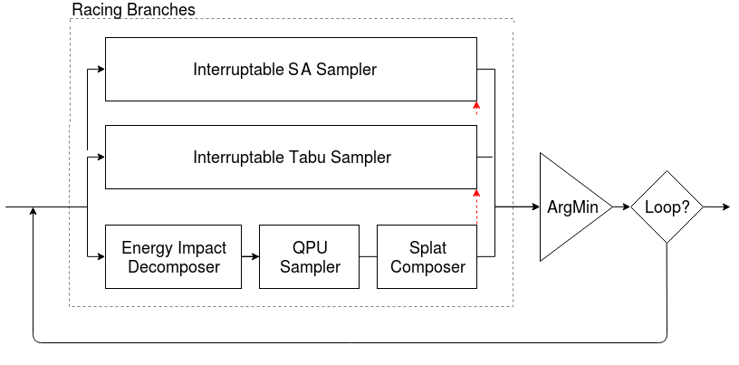

[](
  https://circleci.com/gh/dwave-examples/hybrid-computing-notebook)

# Hybrid Computing

These notebooks demonstrate how you can apply hybrid solvers to your problem,
create hybrid workflows, and develop custom hybrid components.

* **Notebook 01** will start you off with Leap's cloud-based hybrid solvers and
  out-of-the-box dwave-hybrid samplers and workflows, and requires only familiarity
  with the
  [binary quadratic model](https://docs.ocean.dwavesys.com/en/stable/concepts/bqm.html)
  (BQM) approach to formulating problems for solution on quantum computers.
* **Notebook 02** shows how you create your own workflows using existing dwave-hybrid
  components.
* **Notebook 03** is aimed at developers interested in developing their own hybrid
  components for optimal performance.

## A Few Words on Hybrid Computing

Quantum-classical hybrid is the use of both classical and quantum resources to
solve problems, exploiting the complementary strengths that each provides. As
quantum processors grow in size, offloading hard optimization problems to quantum
computers promises performance benefits similar to CPUs' outsourcing of
compute-intensive graphics-display processing to GPUs.

This [Medium Article](https://medium.com/d-wave/three-truths-and-the-advent-of-hybrid-quantum-computing-1941ba46ff8c)
provides an overview of, and motivation for, hybrid computing.

D-Wave's [Leap quantum cloud service](https://cloud.dwavesys.com/leap) provides
cloud-based hybrid solvers you can submit arbitrary quadratic models to. These
solvers, which implement state-of-the-art classical algorithms together with
intelligent allocation of the quantum processing unit (QPU) to parts of the
problem where it benefits most, are designed to accommodate even very large
problems. Leap's solvers can relieve you of the burden of any current and future
development and optimization of hybrid algorithms that best solve your problem.

[*dwave-hybrid*](https://docs.ocean.dwavesys.com/en/stable/docs_hybrid/sdk_index.html)
provides you with a Python framework for building a variety of flexible hybrid
workflows. These use quantum and classical resources together to find good
solutions to your problem. For example, a hybrid workflow might use classical
resources to find a problem’s hard core and send that to the QPU, or break a large
problem into smaller pieces that can be solved on a QPU and then recombined.

The *dwave-hybrid* framework enables rapid development of experimental prototypes,
which provide insight into expected performance of the productized versions. It
provides reference samplers and workflows you can quickly plug into your
application code. You can easily experiment with customizing workflows that best
solve your problem. You can also develop your own hybrid components to optimize
performance.



## Installation

You can run this example
[in the Leap IDE](https://ide.dwavesys.io/#https://github.com/dwave-examples/hybrid-computing-notebook).

Alternatively, install requirements locally (ideally, in a virtual environment):

    pip install -r requirements.txt

## Usage

To enable notebook extensions:

```bash
jupyter contrib nbextension install --sys-prefix
jupyter nbextension enable toc2/main
jupyter nbextension enable exercise/main
jupyter nbextension enable exercise2/main
jupyter nbextension enable python-markdown/main
```

To run the notebook:

```bash
jupyter notebook
```

## License

Released under the Apache License 2.0. See LICENSE file.
